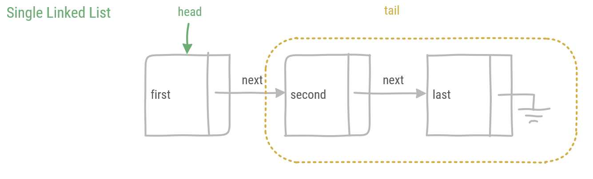

# Linked Lists

Linked lists are a basic data structure. Whereas conventional arrays are created with a fixed size, linked lists grow or shrink dynamically. In contrast, in an array elements can be accessed by their index, in a linked list only particular elements can be accessed directly.

:::warning
The **list** data structure in Python is not a linked list. Also Python does not have conventional arrays with a fixed size, fixed size arrays are data structures used in languages such as C and C#, or hidden beneath useful layers of abstraction.
:::

Three variants of linked lists exist:

* Single Linked Lists
* Double Linked Lists
* Circular Linked Lists

## Single Linked Lists

A single linked list consists of *nodes*. These nodes contain an element and a reference to the next node in the list.


In Python a node can be defined as follows:

```python
# defines a node in a singly linked list
class _Node:
    # constructs a node with an element and a next node 
    def __init__(self, element, nextNode):
        self.__element = element
        self.__next = nextNode

    # returns the element at the node
    def get(self):
        return self.__element
    
    # returns the next node
    def next(self):
        return self.__next
```

:::tip
The _Node class starts with a underscore to indicate it should not be used outside the scope of a Single Linked List class. When imported from the Python file, symbols starting with an underscore will not be automatically included. This has a good reason. A node is actually part of the implementation of the Single Linked List and when defining the Single Linked List class, no nodes should be exposed to the user of the Single Linked List. An important design principle in programming is to program towards an interface, not an implementation. This way the implementation might change, while the interface remains the same.
:::

### Constructing single linked lists

In a single linked list, the first node is known as the *head*. All other nodes are defined as the *tail*. When traversing through the list to the last node, the last node ends the single linked list with a reference to **None**. This is indicated in the figure with a ground symbol.



The Single Linked List class is constructed as follows:

```python
# defines a single linked list
class SingleLinkedList:
    # constructs an empty single linked list
    # or if provided a _Node the single linked list starts with the provided _Node
    def __init__(self, first = None):
        self.__head = first
```

The default first argument in a Single Linked List is **None**. To construct an empty Single Linked List, the constructor is called without providing any arguments:

```python
list = SingleLinkedList()
```

It is important to check if the list is empty before accessing the head element. If the list is empty, head will refer to **None**. Calling any method on **None** will result in an **AttributeError**.

```python
    # returns True if the single linked list does not contain any elements
    def isEmpty(self):
        return self.__head is None
            
    # returns the first element in the singly linked list or None if empty
    def head(self):
        if self.isEmpty():
            return None
        else:
            return self.__head.get()
```

Rather than returning the Node (which should be kept private, don't show any private parts), calling head returns the element or None if the list is empty.

If the head of the single linked list is the first element, then the tail is the rest of the list. The tail of a single linked list is a single linked list by itself.

```python
# returns a single linked list containing all but the first element
    def tail(self):
        if self.isEmpty():
            return SingleLinkedList()
        else:
            return SingleLinkedList(self.__head.next())
```

To prevent an AttributeError when calling tail on an empty list, the method returns an empty single linked list.

### Adding elements

Typically elements are prepended to a single linked list. This means the element is placed before the head element, and becomes the head element of the list itself. The reason to prepend rather than append is that only the head element is accessible.


In code this requires creating a new node in the single linked list and assigning it to the head property. The only tricky part is that the old head is used as the next reference. Because of precedence in evaluation this can be written in a single line.

```python
    # adds an element at the head of the single linked list
    def prepend(self, element):
        self.__head = _Node(element, self.__head)
        return self
```

In this implementation of the prepend method, the **self** reference is returned. This is actually not really necessary, but it is a nice trick to allow chaining multiple prepends on the same single linked list. An example:

```python
    list = SingleLinkedList()
    list.prepend(3).prepend(2).prepend(1)
```

The opposite of adding elements is removing them. Removing the head element of the list is actually already implemented. Calling the tail method returns a list which does not include the original head element. Note that the original list still remains unchanged.

### Traversing the list

Iterating over the single linked list can be done in two ways: with a loop or recursively.

First let's count the number of elements in the list using a loop.

```python
    #returns the number of elements in the list
    def size(self):
        count = 0
        cursor = self.__head
        while not cursor is None:
            count +=1
            cursor = cursor.next()
        return count
```

Traversing a single linked list with a loop usually requires a cursor, this cursor is updated with the next reference every step of the loop, until it reaches the end of the list.


It is also possible to write a recursive method to traverse the list.

```python
    #returns the number of elements in the list
    def size(self):
        def count(n, cursor):
            if cursor is None:
                return n
            else:
                return count(n+1, cursor.next())

        return count(0, self.__head)
```

In order to keep the interface of the count method the same, a nested function is used. The nested function *count* has two parameters, (1) the number of counted elements *n* and (2) the *cursor* node. If *cursor* is **None**, the end of the list has been reached and the method can return the number of elements. In the other case the number of elements is incremented and the cursor node becomes the next node. 

Now, only the first call of *count* needs to be constructed. This will bootstrap the recursive function. Calling *count* with initial values 0 and the head of the single linked list, does the trick. Looking closely at both versions of the size method, reveals that both are actually similar. Yet initialization, the stop condition, progressing through the list and the actual operations to calculate the count have been rearranged.

### Analysis

Big-O analysis of the single linked list reveals that most operations are constant time. Except for methods which traverse the list, such as *size*. This is in linear time, which is to be expected.

| Method | Big-O |
| ----- | ----- |
| isEmpty | O(1) |
| head | O(1) |
| tail | O(1) |
| prepend | O(1) |
| traverse | O(n) |

## Double Linked Lists

## Circular Linked Lists
