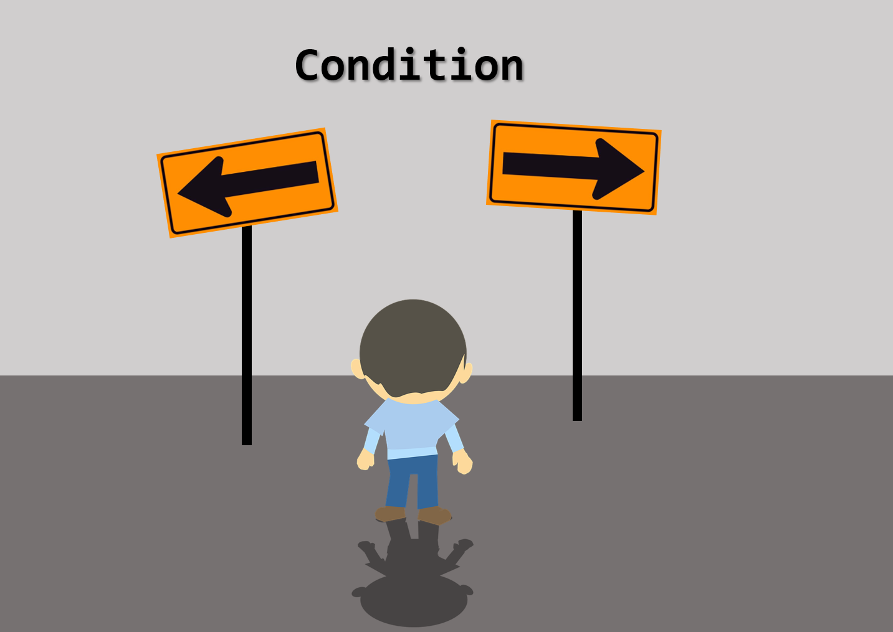
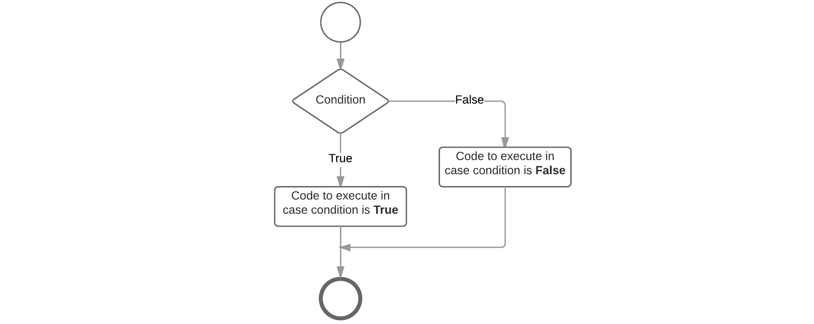
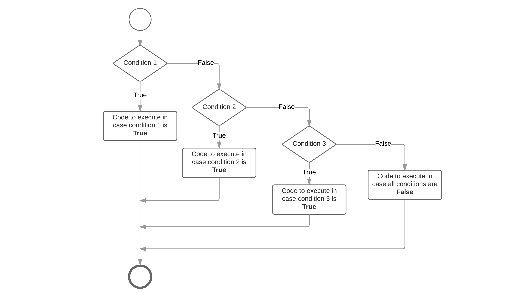

# Python language concepts

## Variables

Applications need to store all sorts of data. From simple things such as numbers, characters and string to complex data types that a programmer can define for himself.

This data is stored, manipulated and outputted through the application. The data itself is stored inside the memory of the computer or system the program is running on. Inside your application you do not need to access the memory directly, for this you can make use of variables.

A variable is a **symbolic name** for information. The variable's name should represent what information the variable contains. They are called variables because they represent *information that can change*.

You may actually have already been using variables for quite a while. When doing math you also use symbolic names for variables. For example

```
x = 15
y = 13

p = x * y
```

Or when defining a linear equation

```
y = f(x) = ax + b
```

### Declaring a variable

Compared to languages such as C++ and Java, Python is a dynamic typed language. This means that we do not have to define a variable and its type before using it. Python is pretty smart when it comes to variables as it interprets and declares variables when they are being set equal to a value. It also automatically determined the type of the variable based on the value assigned to it.

The type of the variable determines the size and layout of the variable's memory; the range of values that can be stored within that memory; and the set of operations that can be applied to the variable.

Let's take a look at an example where a variable `numberOfStudents` is assigned an integral value to store the number of students in the classroom. Based on the integral value assigned to the variable Python knows it should store the value as an integer. Next the result can be printed to the terminal. When you wish to use the content of the variable, all you need to do is state the symbolic name where you would otherwise
use a value.

```Python
# Storing the number of students in the classroom
numberOfStudents = 31

# Print age
print(age)
```

The variable can be assigned a value or changed using the **assignment operator** `=`. This is basically the same as in
math. On the left hand side you have the variable name which you want to assign and on the right hand side the value.

If you wish to place a text string before the value of `numberOfStudents` you can use the string concatenation operator `+` when passing the data to the `print` function. Do note that you need to explicitly tell Python to convert the integral `numberOfStudents` value to a string by passing `numberOfStudents` to the `str()` function as shown in the code below:

```Python
# Storing the number of students in the classroom
numberOfStudents = 31

# Print with concatenation
print("Our current course has " + str(numberOfStudents) + " students attending it.")
```

The assignment operator can also be used to assign one variable's value to another.

```Python
# Storing the number of students in the classroom
numberOfStudents = 31
numberOfOccupiedChairs = numberOfStudents

# Print with concatenation
print("Our current course has " + str(numberOfStudents) + " students attending it.")
print("This means that there are " + str(numberOfOccupiedChairs) + " seats taken.")
```

The inverse operations are also available in Python:

* int(variable) - casts variable to integer
* str(variable) - casts variable to string
* float(variable) - casts variable to float (number with decimal)

If you want to use the value of a variable in an expression or statement then that variable must exist. If it doesn't then Python will generate an error like:

```
Traceback (most recent call last):
  File "C:\Users\nicod\Desktop\test.py", line 9, in <module>
    notAnExistingVariable
NameError: name 'notAnExistingVariable' is not defined
```

## Operators

### Mathematical Operators

The Python programming languages has a lot of operators. Two operators have already been discussed, namely the assignment operator `=` and the string concatenation operator `+`.

The most basic operators are the mathematical operators. They are easy to understand because they have the same functionality as in math. The following operators are available to do basic math operations:

* `+` Additive operator (also used for String concatenation)
* `-` Subtraction operator
* `*` Multiplication operator
* `/` Division operator
* `%` Remainder operator
* `**` Power operator
* `//` Floor division operator

These operators are part of the **binary operators** because they take **two operands**, namely a left and a right operator. Both of the operands can be either a literal value (such as `12`) or a variable. For example in the summation below `left` is the left operand and `right` is the right operand. The result of the operation is stored in the variable `total`.

```python
right = 14
left = 12

total = left + right
# total is now 26
```

The `+`, `-` and `*` operators function the same as in math. Their use can be seen in the code below.

```python
a = 2 + 3
print("a = " + str(a))
# a = 5

b = a + 5
print("b = " + str(b))
# a = 10

c = 6 * b
print("c = " + str(c))
# c = 60

d = c - 120;    // d = -60
print("d = " + str(d))
# d = -60

print("Two to the fourth power:")
print(2**4)
# 16
```

The power operator `**` takes as a left operand the base number and as a right number the power.

The division and remainder operators deserve some special attention. The division operator has a different result based on the types of its left and right operand. If both are of an integral type then a whole division will be performed. Meaning that `3 / 2` will result in `1`. If either operand is a floating point operand than the division operator will perform a real division: `3.0 / 2` will result in `1.5`. The remainder operator will give you the remainder after a whole division.

If your operands are of integral type and you wish to perform a real division, you can always multiply one of the operands with `1.0` to explicitly convert it to a floating point number. Or you can use a `float()` cast.

The floor division operator `//` will always perform a real division but will floor the result.

Let us take a look at some examples.

```python
x = 5
y = 2

z = x / y
print("z = " + str(z))    #  (whole division)
# z = 2

# Attention this is still a whole division
# but the result is converted to float
w = float(x / y)
print("w = " + str(w))
# w = 2.0

q = float(x) / y          # (real division)
print("q = " + str(q))
# q = 2.5

t = 1.0 * x / y          # (real division)
print("t = " + str(t))
# t = 2.5

r = x % y                # Remainder
print("r = " + str(r))
# r = 1
```

Notice that even `w = float(x / y)` results in `2.0`. The reason behind this is that `x / y` equals to `2` as it is a whole division since both operand are of integral type. The result is then cast to a float, and stored in `w`.

While the precedence (order) in which mathematical operations are performed is defined in Python, most programmers do not know all of them by heart. It is much more clear and simpler to use round brackets `()` to enforce the precedence of the calculations.

### Compound Operators

Programmers are very lazy creatures that are always looking for ways to make their life's easier. That is why the compound operators were invented. They are a way to write shorter mathematical operations on the same variable as the result should be store in.

```python
x = 5;

x += 4    # Same as writing x = x + 4
x -= 4    # Same as writing x = x - 4
x *= 4    # Same as writing x = x * 4
x /= 4    # Same as writing x = x / 4
x %= 4    # Same as writing x = x % 4
x //= 4   # Same as writing x = x // 4
x **= 4   # Same as writing x = x ** 4
```

## Making Decisions



The statements inside your source files are generally executed from top to bottom, in the order that they appear. Control flow statements, however, break up the flow of execution by employing decision making, enabling your program to conditionally execute particular blocks of code. This section describes the decision-making statements such as if-then, if-then-else and the if-elif-else statements supported by the Python programming language.

The Python language does not support a switch statement as many other programming languages do.

### Conditions

To allow our program to make certain decisions we first need to take a look at conditions and how they are evaluated.

A condition is some sort of comparison (or a combination of comparisons) that can be evaluated by the compiler or interpreter. After solving all comparisons and combining all the individual parts, the interpreter resolves it to a single resulting value that is `True` or `False` (also keywords in Python). Generally spoken we state that the interpreter evaluates the condition to be true or false.

The true and false values can differ from language to language, however internal in memory false is most of the time "0" and true is "not 0".

#### Comparison Operators

The table below shows the available comparison operators that can be used in Python to build a condition.

| Operator | Short Name| Description |
|---|---|---|
| `==` | equal | If the values of the two operands are equal, then the condition evaluates to `True` |
| `!=` | not equal | If values of the two operands are not equal, then the condition evaluates to `True` |
| `>` | greater than | 	If the value of the left operand is greater than the value of the right operand, then the condition evaluates to `True`. |
| `>=` | greater than or equal to | If the value of the left operand is greater than or equal to the value of the right operand, then the condition evaluates to `True`.
| `<` | less than | If the value of the left operand is less than the value of the right operand, then the condition evaluates to `True`. |
| `<=` | less than or equal to | If the value of the left operand is less than or equal to the value of the right operand, then the condition evaluates to `True`. |

:::warning Deprecated `<>` comparison operator
 Some scripts may also use the not-equal operator `<>` which has the exact same meaning as the `!=` operator. However this former is deprecated and even removed in Python 3.x
:::

Since a conditional statement actually produces a single `True` or `False` result, this result can actually be assigned to a variable.

Let's take a look at some examples of comparison operators:

```Python
a = 4
b = 8
result
result = (a < b)   # True
result = (a > b)   # False
result = (a <= 4)  # a smaller or equal to 4 - True
result = (b >= 9)  # b bigger or equal to 9 - False
result = (a == b)  # a equal to b - False
result = (a != b)  # a is not equal to b - True
```

Note how we need to use two equality signs `==` to test if two values are equal, while we use a single sign `=` for assignment.

While the comparison operators will not often be used in a situation as shown in the code above, they will often be used when making decisions in your program.

#### Conditional Operators

When creating more complex conditional statements you will need to use the conditional operators to create combinations of conditions.

The table below gives an overview of the available conditional operators in Python.

| Operator | Short name | Description |
|---|---|---|
| `and` | logical and | If both the operands are true then the condition evaluates to `True`.	|
| `or` | logical or | If any of the two operands are non-zero then the condition evaluates to `True`.	 |
| `not` | logical not | Used to reverse the logical state of its operand. |

These work as you know them from the Boolean algebra. The `or` operator will return `True` if either of the operands evaluate to `True`. The `and` operator will return `True` if both operands evaluate to `True`. A logical expression can be negated by placing the `not` operator in front of it.

The code example below checks if a person is a child based on it's `age` (between 0 and 14 years of age).

```Python
age = 16
isAChild = (age >= 0 and age <= 14)      # False
```

### The if statement

The `if` statement is the most basic of all the control flow statements. It tells your program to execute a certain section of code only if a particular condition evaluates to `True`.

Let's take for example a very simple example where we test if the students score is below 70% and if so we output an encouraging speech.

```Python
studentScore = 60     # Change this to test the code below

print("Your score is " + str(studentScore) + "%")
if studentScore < 70:
    print("Come on buddy, you will need to work a little harder.")
    print("You can do it. Still got some time till the exams.")
```

If this test evaluates to `False` (meaning that the score is equal or above 70), control jumps to the end of the if statement.

Important to note it that no parentheses are placed around the condition which is often necessary in other programming languages. Python on the other hand requires a colon `:` after the condition and also requires the code block that need to be executed in case the condition evaluates to `True` to be **indented**. This syntax is very typical of Python and often error prone for beginners. So make sure to take care of your indentation.

An if-statement can also be visually represented using a flowchart as shown below.


### The if-else Statement

The if-else statement provides a secondary path of execution when an "if" clause evaluates to `False`. Taking the previous example you could output a "good job" speech when the students score is equal or above 70%.

```Python
studentScore = 60     # Change this to test the code below

print("Your score is " + str(studentScore) + "%")
if studentScore < 70:
    print("Come on buddy, you will need to work a little harder.")
    print("You can do it. Still got some time till the exams.")
else:
    print("Good job. Keep up the good work.");
```

Note that no condition is required for the `else` clause but is does however follow the same syntax as the if-clause concerning the colon `:` at the end and the indentation required for the code block that must be executed in case the else-clause is reached. The else code block is executed when the if-condition does not evaluate to `True`. This can be visually represented with the flowchart shown below.



### If - elif - else statements

The if-else statement can be extended with **even more if statements**. Each if-clause will need a new condition that needs to be checked. The first one that evaluates to `True` is executed, after which control jumps to the end of the if statements. In Python an extra if-clause is added by using the keyword `elif` which is short version of `else if` used in many other programming languages.

Important to understand is that the conditions of all these clauses are checked sequentially and not parallel. So the second is only checked if the first is not met. The third is only checked if the second and first are not met, and so on ...

Let's extend our grading example to be a bit more student friendly:

```Python
studentScore = 60     # Change this to test the code below

print("Your score is " + str(studentScore) + "%")
if studentScore >= 90:
    print("Omg, good job. Keep up the work.")
elif studentScore >= 70:
    print("Some room for improvement but you are on your way.")
elif studentScore >= 50:
    print("Ok. But you may want to considering studying a bit more.")
elif studentScore >= 30:
    print("Come on buddy, you will need to work a little harder.")
else:
    print("You may want to cancel your holiday vacation for studying.")
```

You may have noticed that the value of `studentScore` can satisfy more than one expression in the code above. Remember that the conditions are checked sequentially and once a condition is satisfied, the appropriate statements are executed and the remaining conditions are not evaluated anymore. The last else-clause is a kind of default path of execution in case none of the conditions are met. This can also be visually represented using a flowchart.



### Combined Conditions

When building conditions one often needs conditional operators to build more complex conditions.

Take a look at the example below that checks if a frequency value is within a valid range using the conditional `and` operator. It only resolves to `True` if both the left and right operand resolve to `True`.

```python
frequency = float(input("Please enter the buzzer frequency (Hz): "))

if (frequency >= 100 and frequency <= 10000):
  print("Buzzing like a hummingbird")
else:
  print("Sorry, invalid frequency")
```

Consider the following example that asks the user to input the value that should be send to the a GPIO. If it is not a valid value (`0` or `1`) than it issues an error.

```python
value = int(input("Would you like to make the GPIO 1 or 0? "))

if value == 1 or value == 0:
  print("Setting IO to " + str(value))
else:
  print("Sorry you entered an invalid value.")
```

Combining with the `not` operator it is easy to invert conditions. The example below checks if the user input contains valid values and if it doesn't it gives the user an error message.

```python
state = str(input("Would you like to make the IO high or low? "))

if not (state == "high" or state == "low"):
  print("Sorry you entered an unknown state.")
elif state == "high":
  print("Making IO go high")
else:
  print("Making IO go low")
```

:::warning Lazy evaluation

 These operators exhibit "short-circuiting" behavior, which means that the second operand is evaluated only if needed. This is also called lazy evaluations. So for example in an OR condition, if the first operand is `True`, the outcome must also be `True`. For this reason the second operand is not checked anymore. The same happens with an AND condition. If the first operand resolves to `False`, the second operand is not evaluated anymore and the condition resolves to `False`.
:::

### Nesting if-statements

There may be situations where you want to check for another condition after a condition resolves to `True`. In such a situation, you can use the nested if construct.

In a nested if construct, you can have an if-elif-else construct inside another if-elif-else construct. While there is no hard limit on the nesting level, common sence and code readability dictates not to nest deeper than two levels.

Let us take an example application to calculate the BMI (Body Mass Index) op a person. In this case it is a good idea to check if the user did not accidently enter a height of `0`, which would result in a `ZeroDivisionError` crash.

```python
height = float(input("Please enter your height (m): "))
weight = float(input("Please enter your weight (kg): "))

if height == 0:
  print("Sorry, cannot divide by zero as this would crash the application")
else:
  bmi = weight / (height * height)

  print("Your BMI is " + str(bmi))
  if bmi < 18.5:
    print("You might be a bit underweight")
  elif bmi >= 18.5 and bmi <= 25:
    print("All is normal")
  else:
    print("You might be a bit overweight")
```

Note how the application first checks if the divisor is zero in which case it would skip the bmi calculation. If all is good, the bni is calculated and a nested if-elif-else statement displays a informational message to the user. Also note the combined condition `bmi >= 18.5 and bmi <= 25` which checks if the bmi is inside a range.

## Loop statements

In general, statements are executed sequentially: The first statement in a block is executed first, followed by the second, and so on. There may however be situations where you need to execute a block of code several number of times. Programming languages provide various structures that allow you to loop a block of statements.

The Python programming language provides the following types of loops to handle looping requirements:

* **for loop**: Execute a code block multiple times and simplify the code that manages the loop variable.
* **while loop**: Repeats a code block while a given condition is true. It tests the condition before executing the body of the loop.

### The for loop

Basically a for loop is most often used when the number of iterations is pre-determined. A typical example would be a list of items where actions needs to be applied to each item in the list.

Python's for loops are pretty different compared to most other languages. The idea of a for loop is rather simple, you will just loop through some code for a certain number of times.

Compared to other languages, Python's for-loop can be compared more to for example an enhanced for-loop from Java or a for-each from Ruby. It does not iterate between a start and end number but iterates over a list or at the pace of iterator.

The for loop adheres to the following construction template:

```Python
for varName in range(start,end,stepsize):
  # Codeblock
```

* **varName**: the name of the local variable taking the value of the current item in the list (often `i`)
* `range` is a function used to create an iterator which starts at `start` (inclusive) and ends at `end` (exclusive). An optional `stepsize` can be provided.

When you're using an iterator, every loop of the for statement produces the next number on the fly.

Also, notice the `in` keyword. This is actually part of the for loop and you will understand it a bit better after we deal with lists and dictionaries.

Each loop around the iteration makes the iterator step one forward and checked against the end-value. If it is not reached yet, the code is executed again and the iterator is increased once more. This continues until the end-value is reached.

Let's see the most simple example possible. A simple for loop that outputs the text `"Hello"` 10 times to the terminal.

```Python
for i in range(0,10):
  print("Hello")
```

Want to see the values of `i`? Use the following code:

```python
for i in range(0,10):
  print(str(i) + ": Hello")
```

This outputs:

```
0: Hello
1: Hello
2: Hello
3: Hello
4: Hello
5: Hello
6: Hello
7: Hello
8: Hello
9: Hello
```

You can not just specify the start and stop values for the range, but also the step size which should be taken. The step size can be added as a third parameter to the range function. An example with a step size of 2 is shown below.

```Python
for i in range(0,10,2):
  print(str(i) + ": Hello")
```

Which outputs:

```
0: Hello
2: Hello
4: Hello
6: Hello
8: Hello
```

### The while loop

A while loop statement in the Python programming language repeatedly executes a statement block as long as a given condition is true. The condition is checked before the code block is executed. This means that the code block of the while loop may not even run at all if the condition is not met.

The while loop adheres to the following construction template:

```python
while <condition>:
  # Code Statements
```

This can also be translated into the flow chart shown below.


Below is an example script that print out the first 10 numbers that are dividable by `3`:

```python
divident = 3
currentValue = 1
count = 0

while count < 10:
  if currentValue % divident == 0:
    print("Found that " + str(currentValue) + " is dividable by " + str(divident))
    count += 1

  currentValue += 1
```

The example above shows how an if-statement can be nested inside a while loop. While the number of times you can nest a structure inside another is directly limited it should be kept to a minimum. The deeper structures get nested the more complex your code starts to become.

Which outputs:

```
Found that 3 is dividable by 3
Found that 6 is dividable by 3
Found that 9 is dividable by 3
Found that 12 is dividable by 3
Found that 15 is dividable by 3
Found that 18 is dividable by 3
Found that 21 is dividable by 3
Found that 24 is dividable by 3
Found that 27 is dividable by 3
Found that 30 is dividable by 3
```

#### Infinite loop

Often one will find a while-loop with the condition replaced by the keyword `True`. This is a loop that will run forever and can only be stopped by using a kill signal (for example process kill or CTRL-C). This is often found in applications that require to run as a daemon (process that runs in the background).

Example of an infinite loop:

```python
from time import sleep

while(True):
  print("Alive ...")
  sleep(1)          # Time in seconds.
```
## Lists

A basic data structure in Python is the list. In a list the elements are stored sequentially and accessible via a positional number called the index. The first index is zero, the second index is one, and so forth.

There are certain things you can do with lists such as indexing, slicing, adding, multiplying, .... In addition, Python has built-in functions for finding the length of a list and for finding its largest and smallest elements.

Only the basic operations are discussed further in this course as otherwise they would lead us too far away from basic python.

### Creating a list

The list is a very versatile datatype which can be written as a list of comma-separated values (items) between square brackets. Important  about a list is that items in a list does not need to be of the same type.

Let us take a look at an example:

```python
names = ['Mark', 'Danny', 'Elly', 'Joany', 'Donny']
numbers = [1, 2, 3, 4, 5, 6, 7, 8, 9]
characters = ['a', 'b', 'c']
```

Python can print whole list by just supplying them to the print function:

```python
names = ['Mark', 'Danny', 'Elly', 'Joany', 'Donny']
numbers = [1, 2, 3, 4, 5, 6, 7, 8, 9]

print(names)
print(numbers)
```

Which would output the following to the console:

```
['Mark', 'Danny', 'Elly', 'Joany', 'Donny']
[1, 2, 3, 4, 5, 6, 7, 8, 9]
```

### Accessing elements in a list

Accessing single elements in a list can be achieved by specifying the index of the element between square brackets as shown below.

```python
names = ['Mark', 'Danny', 'Elly', 'Joany', 'Donny']

# Prints "Mark"
print(names[0])
```

You can print them using a for-loop and an iterator `i` created by the range function:

```python
names = ['Mark', 'Danny', 'Elly', 'Joany', 'Donny']

for i in range(0,len(names)):
  print("[{}] {}".format(i, names[i]))
```

Notice the different way of creating a string with values of variables substituted inside the string itself. By adding curly braces where a value is expected and calling the format method on that string, the actual values can be substituted for the curly braces.

The code above would generate the following output:

```
[0] Mark
[1] Danny
[2] Elly
[3] Joany
[4] Donny
```

When iterating over lists, a for-loop is often written as follows, where the iterator is actually the element of the list itself:

```python
names = ['Mark', 'Danny', 'Elly', 'Joany', 'Donny']

for name in names:
  print(name)
```

The above syntax is much cleaner and more human readable.

Resulting in:

```
Mark
Danny
Elly
Joany
Donny
```

### Assigning and adding elements to a List

Values in a list can be retrieved using an index, but they can also be assigned a new value in a similar way. Take a look at the example below where a for-loop construct replaces all the elements in the list with their square number.

```python
numbers = [1, 3, 8, 19, 22, 85]

print("Before: " + str(numbers))

for i in range(0, len(numbers)):
  numbers[i] = numbers[i] * numbers[i]

print("After: " + str(numbers))
```

The above cannot be rewritten using a list iterator as this acts as a local variable. The value change would not be reflected to the actual list.

Adding an item to a list can be achieved by using the method `append()` on the list and supplying the method with the item to add.

```python
chars = []

for i in range(0,len("Hello")):
  chars.append("Hello"[i])

print(chars)
```

Notice how a literal string can also be indexing as it were a list.

The previous code results in the output:

```
['H', 'e', 'l', 'l', 'o']

```

## Classes

Classes provide a means of bundling data and functionality together.

Python has been an object-oriented language from the beginning. Because of this, classes and object have been integrated deeply into the language. Creating classes and objects from those classes are very easy. This chapter expects you to have a basic knowledge of OOP and its concepts. However, following is a small overview of the most important terminology and concepts.

* A **class** a user-defined prototype for an object that defines a set of attributes that characterize any object of that class. The attributes are data members (class variables and instance variables) and methods, accessed via dot notation `object.method()`.
* A **class variable** is shared by all instances of a class. Class variables are defined within a class but outside any of the class's methods. Class variables are not used as frequently as instance variables are.
* An **instance** is an individual object of a certain class. An object that has been created from a class Circle, for example, is an instance of the class Circle.
* An **instance variable** is a variable that is defined inside a method and belongs only to the current instance of that class, the object in other words.
* **Instantiation** is the creation of an object of a class.
* A **method** is a kind of function that is defined in a class definition. The methods belonging to the class define the **behavior** of the objects of that class.
* An **object** is a unique instance of a data structure that is defined by its class. An object comprises both data members (class variables and instance variables) and behavior (methods).
* **Method overloading** is the assignment of more than one behavior to a particular method. The operation performed varies by the types of objects or arguments involved.
* **Inheritance** is the extension of existing classes with new data and/or behavior.

### Creating Classes

To create a class, one can follow the syntax shown below:

```python
class <NameOfClass>:
  """Descriptive string of class function"""

  # Methods ...
```

The `class` keyword is mandatory and so is the name of the class. Naming classes in Python follows Camel Case convention.
<!-- TODO: Descriptive string explanation -->

### Methods

Adding functionality to a class in the form of methods is achieved using the `def` keyword and the template shown below:

```python
class <NameOfClass>:
  """Descriptive string of class function"""

  # Methods ...
  def <name_of_method>(self, <arguments>):
    # Statements ...
```

The `self` keyword is implicitly populated with the object the method is called on, however when defining the method inside the class it needs to be explicitly noted as the first argument. The rest of the arguments are the data that the creator of the class requires for the method to do its processing.

#### Constructor

A special method is the constructor which is responsible for delivering a valid object when the user of the class request the creation of a new instance. This method has the mandatory name `__init__`. Based on your requirements you can pass arguments to the object's constructor.

```python
class <NameOfClass>:
  """Descriptive string of class function"""

  # Constructor
  def __init__(self, <arguments>):
    # Initialize object

  # Methods ...
  def <name_of_method>(self, <arguments>):
    # Statements ...
```

Compared to many other programming languages Python does not allow you to create multiple constructors (constructor overloading).

### Creating Objects from a Class

Creating objects from a class in Python uses function notation. Just pretend that the class object is a parameterless function that returns a new instance of the class (actually the constructor method is implicitly called).

```python
obj = NameOfClass()
```

### Instance Variables or Attributes

To assign or access attributes of the class you need to make use of the dot-notation on the `self` keyword. As with variables, in Python one does not need to declare attributes before using them.

```python
class <NameOfClass>:
  """Descriptive string of class function"""

  # Constructor
  def __init__(self, <arguments>):
    # Initialize object

  # Methods ...
  def <name_of_method>(self, <arguments>):
    # Statements ...
    self.<name_of_attribute> = <value>
```

### Returning Values from Methods

Methods can also return a single value using the `return` keyword. In this case the code that calls the method can assign the return value to a variable.

```python
  # Method that returns a value
  def <name_of_method>(self, <arguments>):
    return <some_value>
```

### Example

Let us put all of this into practice and create a class `Robot`.

```python
class Robot:
  """Class that models a talking robot"""

  # Constructor with no arguments
  def __init__(self):
    # Here we set the name argument
    # as an attribute of the object
    self.name = "Nameless"

  def say_hello(self):
    # We can access the name attribute via the
    # self reference and the dot-operator
    print("Hello I am " + self.name)

  # Method allows us to rename the robot
  # @name: name of the robot
  def set_name(self, name):
    self.name = name

  def get_name(self):
    return self.name
```

When creating a Robot we need to save the object in a variable:

```python
# Create a Robot object
myRobot = Robot()

# Call a method on the Robot object
myRobot.say_hello()

# Rename the robot
myRobot.set_name("Pokey")
myRobot.say_hello()

name = myRobot.get_name()
print("The robot is called " + name)
```

To test this out you can just add the class definition of `Robot` to a Python script and place the instantiation code below it as shown here:

```python
class Robot:
  """Class that models a talking robot"""

  # Constructor with no arguments
  def __init__(self):
    # Here we set the name argument
    # as an attribute of the object
    self.name = "Nameless"

  def say_hello(self):
    # We can access the name attribute via the
    # self reference and the dot-operator
    print("Hello I am " + self.name)

  # Method allows us to rename the robot
  # @name: name of the robot
  def set_name(self, name):
    self.name = name

  def get_name(self):
    return self.name

# Create a Robot object
myRobot = Robot()

# Call a method on the Robot object
myRobot.say_hello()

# Rename the robot
myRobot.set_name("Pokey")
myRobot.say_hello()

name = myRobot.get_name()
print("The robot is called " + name)
```

Which outputs:

```
Hello I am Nameless
Hello I am Pokey
The robot is called Pokey
```
