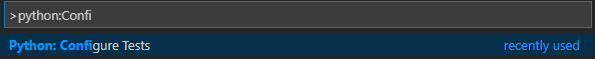

# Testing

Validating the correct operation of software is a cumbersome and repetitive task. In Python, results can be checked as part of an interactive script or printing output to the console. However this is not recommended. Manually validating the results of software is advised against, because of the following reasons:

1. When validating the results, it is easy to miss or ignore corner cases.
1. When changing the program, all possible cases should be checked in order to avoid mistakes introduced by the change (i.e. regression).
1. Setup of software might require many or complex steps.
1. It is easy to miss mistakes when manually validating the output of software.

These problems can be solved by developing a test script to check the correct operation of the software. A test script can be developed at the same time or even before the software under test has been written. Writing tests has several benefits:

1. Tests allow to explore many different cases, every time the tests are run.
1. Setting up complex testing conditions or validating complex output become automated.
1. When changing software, tests can easily detect regression.
1. Tests require a programmatic interface. This effectively improves the design of the software.

## Organizing Python scripts

In order to avoid very long scripts, Python code is organized in modules. For instance, a test script loads the software under test as a module. Modules can be imported with the **import** keyword. An example of a simple increment module:

```python
# Module counting is defined in the file counting.py
def inc(n):
    return n+1

def dec(n):
    return n-1
```

In a different file the module can be imported:

```python
import counting

counting.inc(1)
counting.dec(2)
```

The name of the module is needed to identify the functions. This can be avoided when importing the functions directly from the module:

```python
from counting import inc,dec

inc(1)
dec(2)
```

It is also possible to change the name of the definition upon importing, like this:

```python
from counting import inc as increment, dec as decrement

increment(1)
decrement(2)
```

## pytest

Pytest is a unit testing framework, which provides all basic testing utilities. In order to enable pytest in VSCode: 

1. Run the *Python: Configure Tests* command (Ctrl + Shift + P).
1. Select pytest.
1. Select the root directory containing the tests



### Create a first test

1. Create a file prepended with *test_*.

    ```python
    from counting import inc, dec

    def test_increment():
        assert inc(1) == 1
    ```

    1. Import the module under test.
    1. Write a test function.  
    1. Use the **assert** keyword to verify boolean conditions.
1. By default tests are discovered upon saving, but it is also possible to manually start discovering.
1. Click on *Run Test* or *Run all tests*.
1. Check the test output to discover more information on why the test failed.

::: warning
Don't forget to save the test before running it.
:::

### Object equivalence

When defining a class the default comparison of objects is by reference, namely do the objects have the same address? However two objects with a different address might be considered equivalent if they have the same members. In order to define this, the **\_\_eq\_\_(self, other)** method must be defined. An example:

```python
#robot.py
class Robot:
    def __init__(self, name):
        self.__name = name

#test_robot.py
from robot import Robot

def test_robot_equivalence():
    rob1 = Robot("rob")
    rob2 = Robot("rob")
    assert rob1 == rob2
```

In this example the test will fail. However changing the definition of equality in the Robot class:

```python
#robot.py
class Robot:
    def __init__(self, name):
        self.__name = name

    def __eq__(self, other):
        return isinstance(other, Robot) and self.get_name() == other.get_name()
    
    def get_name(self):
        return self.__name
```

Rerunning the test should pass.

### Pretty error messages

In test output the value of objects is not human readable. The *\_\_repr\_\_* method allows to describe e a useful representation of the object.

```python
#robot.py
class Robot:
    def __init__(self, name):
        self.__name = name

    def __eq__(self, other):
        return isinstance(other, Robot) and self.get_name() == other.get_name()
    
    def get_name(self):
        return self.__name

    def __repr__(self):
        return self.get_name()
```

Note there is also a *\_\_str\_\_* method. This method is intended for external use, namely casting the object to a string.

```python
robot = Robot("rob")
print(str(robot))
```

If *\_\_str\_\_* is undefined in the class, the output of the *\_\_repr\_\_* method is used. It is possible to provide a different implementation to the *\_\_str\_\_* method.

## Conda

Installing packages with your Python installation quickly becomes a convoluted mess. In order to solve this problem, **Conda** the package and environment manager was developed. It allows to quickly install, run and update packages and their dependencies. Conda creates an "environment" in which a specific version of each package can be loaded or even a specific version of a Python interpreter. It installs packages from the Anaconda repository.

1. Install [miniconda3](https://docs.conda.io/en/latest/miniconda.html) for your OS.
1. Add *install_path_of_miniconda/Scripts* to your PATH environment variable.
1. Check the installation with:

    ```powershell
    conda --version
    ```

1. Update conda:

    ```powershell
    conda update conda
    ```

1. Open a Powershell with administrator privileges and initialize Conda with the powershell environment:

    ```powershell
    conda init powershell
    ```

1. Create a Conda environment with the CPython 3.8 interpreter and activate that environment:

    ```powershell
    conda create -n [insert env name] python=3.8
    conda activate [insert env name]
    ```

1. Check all Conda environments (the environment indicated with a * is activated)

    ```powershell
    conda info --envs
    ```

1. Check which programs are installed in the current Conda environment

    ```powershell
    conda list
    ```

1. Install a package in the current environment (for instance the numpy package)

    ```powershell
    conda install numpy
    ```

:::warning
Check the Python interpreter used in VS Code. Run the *Python: Select interpreter* command (Ctrl + Shift + P) and select the interpreter used by the Conda environment. 
:::

:::tip
You might want to view more information in your shell about your git status and conda environment. Personally, I recommend Windows Terminal, Powershell with posh-git and oh-my-posh, and a nice font which supports ligatures and glyphs like Fira Code NF. [More information](https://www.hanselman.com/blog/how-to-make-a-pretty-prompt-in-windows-terminal-with-powerline-nerd-fonts-cascadia-code-wsl-and-ohmyposh)
:::