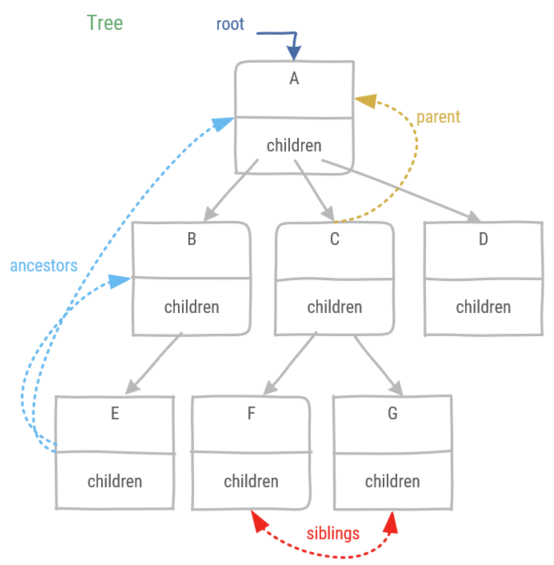

# Tree

A tree is a non-linear data structure. It has a hierarchical relationship, i.e. nodes in a tree have a single *parent* and 0 or more *children*. An exception to this is the *root* node which has no parent. Nodes in a tree which have no children are called *leaves*. A tree is typically represented as:


## Definitions

A tree has a recursive definition:

1. A tree is empty or 
1. It consists of a node r which is called the root and this root has a set of trees which are its children. Note the children set might be empty.



* A *parent* is the node of which the current node is a child. Note: the root node has no parent. For example **A** is the parent of **C**.
* An *ancestor* is either the parent or a parent's node parent. Note: this is a recursive definition. For example **B** and **A** are ancestors of **E**.
* The *siblings* are the nodes which have the same parent. For example **E**, **F**, and **G** are siblings.
* *External* nodes are leaves or the root node. For example **A**, **D**, **E**, **F**, and **G** are external nodes.
* *Internal* nodes are nodes which are not an external node. For example **B**, and **C** are internal nodes.


* An edge is a pair of nodes (u,v) such that u is the parent of v or vice versa. For example (**C**,**G**) is an edge. 
* A path is a sequence of nodes, so that any consecutive nodes form an edge (parent/child relationship). For example (**A**,**B**,**E**) is a path, this can be shortened to (**A**,**E**).
* The depth of node v is the number of ancestors of v excluding v. For example, the depth of **D** is 1.
* The height of a tree is equal to the maximum depth. The height of the example tree is 2.

## Binary tree

A *binary tree* is a tree where each node has at most two children. These children are known as the left child and the right child. A *proper* binary tree is a tree where each node has 0 or 2 children. The opposite is an *improper* tree.


:::tip
The most efficient implementation of a binary tree is not a linked data structure. Rather a binary tree can be implemented as a dynamic array. The position of the node of the binary tree in the array is defined by its level number p(v).

* If node v is root, then its level number p(v) = 1.
* If node v is the left child of node u then p(v) = 2p(u).
* If node v is the right child of node u then p(v) = 2p(u)+1.

Note that the elements in the example binary tree correspond with the node's level number.
:::

## Heap

A heap is a binary tree, which satisfies two properties:

1. Heap-order property: for every node v, except for the root, in a heap T, the key stored at v is greater than or equal to the key stored at its parent.
1. Complete binary tree property: each level, except for the last, has the maximum number of nodes.

The complete binary tree property has three consequences:

1. At most one node can have one child, and that child must be the left child.
1. The last node is defined as the right-most, deepest external node of the heap.
1. The height of the heap is the binary log of the number of elements **log(n)** in the heap rounded up.

### Heap insertion

1. Add the key k(u) as a new last node, this may temporarily violate the heap order property.
1. Swap the key k(u) with its parent k(z) when k(z) > k(u) & repeat, this is called up-heap bubbling

### Removing from the heap

1. The root element is the element with the smallest key and is removed.
1. In order to preserve the tree structure, copy the last node to the first & delete the last, this may temporarily violate the heap order property.
1. Select a child of r (root) with smallest key value. When k(r) > k(s) swap them & repeat, this is called down-heap bubbling.

### Heap sort

1. First a heap is built out of the data by heap insertion.
1. Then the collection is sorted by repeatedly removing the element at the root.

As heap sort consecutively inserts n elements and removes them in O(log n) time, both phases of heap sort combined take O(n log n), assuming two elements are compared in O(1).

## Tree traversals

A tree traversal is a visit of each of the nodes of a tree in a particular order.


* Preorder: visit the parent before children. Example: A->B->D->H->I->E->J->C->F->G
* Postorder: visit the children before parent. Example: H->I->D->J->E->B->F->G->C->A
* Breath-First: visit all positions at a certain depth. Example: A->B->C->D->E->F->G->H->I->J
* Inorder (only for binary trees): visit left child first, then the position itself, then the right child. Example: H->D->I->B->J->E->A->F->C->G
* Euler tour: each node is visited three times
    1. from the left
    1. from below
    1. from the right

Example for the Euler tour: A left -> B left -> D left -> H left -> H below -> H right -> D below -> I left -> I below -> I right -> D right -> B below -> E left -> J left -> J below -> J right -> E below -> E right -> B right -> A below -> C left -> F left -> F below -> F right -> C below -> G left -> G below -> G right -> C right -> A right

## Tree example

As an example of a software problem which requires a tree, a filesystem can be built. A filesystem is a hierarchical structure of directories, in which directories and files can be stored. In this filesystem the following is defined:

* The filesystem has a single root and it is named "/"
* *ls* lists all files and directories in the current directory
* *mkdir* creates a new directory with a given name in the current directory
  * a directory has a size of 1 plus the size of all files and directories contained in the directory
* *touch* creates a new file with a given name in the current directory
  * a file has a given size
* *cd* changes the current directory
  * ".." changes the current directory to its parent
  * "name" changes the current directory to the subdirectory of the original current directory

First, a TreeNode is defined, the TreeNode is an abstract class. An abstract class is a class which should not be instantiated, i.e. no objects of this class should be created. Rather it serves as a template for classes derived from the abstract class. This means it defines what is common between all derived classes. Note: Python does not provide language support for an abstract class, it remains in fact a regular class.

```python
class _TreeNode:
    def __init__(self, element, parent):
        self._element = element
        self._children = []
        self._parent = parent

    def size(self):
        pass

    def element(self):
        pass

    def parent(self):
        return self._parent

    def isRoot(self):
        return self._parent is None
```

A TreeNode consists of an element, a reference to the parent TreeNode, and a list of its children TreeNodes. The element in this filesystem will be the name of the file or directory.

The methods *size* and *element* are defined as a common method between all derived classes. However, no common implementation is given in this class. Rather it depends on whether the TreeNode is a Directory or a File.

The *isRoot* method checks if the TreeNode has a parent, if not it is the root of the Tree.

:::tip
Using inheritance, to define specific behavior in the derived classes with a common method, is a good example of replacing conditional logic. Rather, a system called dynamic dispatch will call the correct method based on the object's type. In this example: if the object is a File then the *size* method of the File class is called. When the object is a Directory, the *size* method of the Directory class will be called.
:::

```python
class _File(_TreeNode):
    def __init__(self, name, parentDirectory, size):
        super().__init__(name, parentDirectory)
        self.__size = size

    def size(self):
        return self.__size

    def element(self):
        return "f: " + self._element
```

The File class is derived from the TreeNode class.

* Its *size* is defined by an attribute 
* When the *element* method is called, it returns the filename prepended with an "f: " to indicate it is a file.

```python
class _Directory(_TreeNode):
    def __init__(self, name, parentDirectory):
        super().__init__(name, parentDirectory)

    def size(self):
        s = 1
        for node in self._children:
            s += node.size()
        return s

    def items(self):
        return map(lambda i: i.element(), self._children)

    def addChild(self, item):
        self._children.append(item)

    def element(self):
        return "d: " + self._element

    def find(self, name):
        node = None
        for child in self._children:
            if child._element == name:
                node = child
        return node
```

The Directory class is also derived from the TreeNode class.

* Its *size* is calculated by a recursive method. Calling size will traverse the tree in **preorder**.
* When the *element* method is called, it returns the directory name prepended with an "d: " to indicate it is a directory.
* The *addChild* method appends a new child to the list of children. This corresponds with creating subdirectories.
* The *find* method allows to retrieve a child TreeNode based on its name. If the name cannot be found in the children TreeNodes, None is returned.
* The *items* method returns a map of the children of the TreeNode. Rather than returning the children TreeNodes, only the element name of all children are returned.

:::tip
The map function requires two parameters: first a function to be called on each of the elements of a collection and second the collection itself.
The keyword **lambda** indicates an anonymous function. This is a function without a name, which is defined at the place of the first parameter of the map function. Before the semicolon, a name is given to the cursor which is going to iterate over the individual elements of the collection. Behind the semicolon a statement is defined which must be executed at each element of the collection.

A small graphic overview of the map in the example:


:::

The Tree is the filesystem. The public methods of the filesystem are named after the equivalent Unix commands.

```python
class Tree:
    def __init__(self):
        self.__root = _Directory("/", None)
        self.__current = self.__root

    def size(self):
        return self.__root.size()

    def ls(self):
        return list(self.__current.items())

    def touch(self, name, size):
        self.__current.addChild(_File(name, self.__current, size))

    def mkdir(self, name):
        self.__current.addChild(_Directory(name, self.__current))
   
    def cd(self, param):
        if param == ".." and not self.__current.isRoot():
            self.__current = self.__current.parent()
        else:
            node = self.__current.find(param)
            if node is None:
                return
            else:
                self.__current = node

```

* Creating a Tree (or filesystem in this case), sets a root directory, and creates a current directory, which refers to the root at creation.
* The *ls* method uses the *items* method of the Directory class. However, whereas the *items* method returns a map, ls will return a list. Conversion between list and map is straightforward.
* The methods *touch* and *mkdir* are quite similar. A child TreeNode is added to the current directory. Only the relevant subclass of TreeNode is created, respectively File and Directory.
* The *cd* method either goes to the parent directory when the parameter ".." is given or checks whether the given parameter is contained in the current directory. If it does, it changes the current directory to the corresponding TreeNode, if not, nothing happens.
