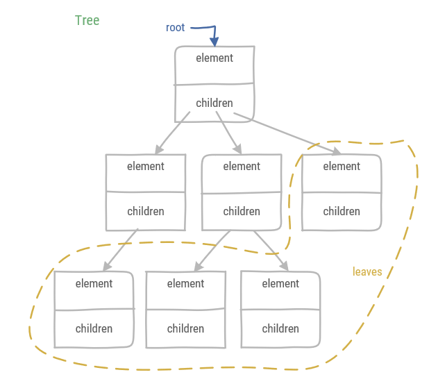

# Tree

A tree is a non-linear data structure. It has a hierarchical relationship, i.e. nodes in a tree have a single *parent* and 0 or more *children*. An exception to this is the *root* node which has no parent. Nodes in a tree which have no children are called *leaves*. A tree is typically represented as:

## Definitions

A tree has a recursive definition:

1. A tree is empty or 
1. It consists of a node r which is called the root and this root has a set of trees which are its children. Note the children set might be empty.

* A *parent* is the node of which the current node is a child. Note: the root node has no parent. For example **A** is the parent of **C**.
* An *ancestor* is either the parent or a parent's node parent. Note: this is a recursive definition. For example **B** and **A** are ancestors of **E**.
* The *siblings* are the nodes which have the same parent. For example **E**, **F**, and **G** are siblings.
* *External* nodes are leaves or the root node. For example **A**, **D**, **E**, **F**, and **G** are external nodes.
* *Internal* nodes are nodes which are not an external node. For example **B**, and **C** are internal nodes.

* An edge is a pair of nodes (u,v) such that u is the parent of v or vice versa. For example (**C**,**G**) is an edge. 
* A path is a sequence of nodes, so that any consecutive nodes form an edge (parent/child relationship). For example (**A**,**B**,**E**) is a path, this can be shortened to (**A**,**E**).
* The depth of node v is the number of ancestors of v excluding v. For example, the depth of **D** is 1.
* The height of a tree is equal to the maximum depth. The height of the example tree is 2.

## Binary tree

A *binary tree* is a tree where each node has at most two children. These children are known as the left child and the right child. A *proper* binary tree is a tree where each node has 0 or 2 children. The opposite is an *improper* tree.

:::tip
The most efficient implementation of a binary tree is not a linked data structure. Rather a binary tree can be implemented as a dynamic array. The position of the node of the binary tree in the array is defined by its level number p(v).

* If node v is root, then its level number p(v) = 1.
* If node v is the left child of node u then p(v) = 2p(u).
* If node v is the right child of node u then p(v) = 2p(u)+1.

Note that the elements in the example binary tree correspond with the node's level number.
:::

## Heap

A heap is a binary tree, which satisfies two properties:

1. Heap-order property: for every node v, except for the root, in a heap T, the key stored at v is greater than or equal to the key stored at its parent.
1. Complete binary tree property: each level, except for the last, has the maximum number of nodes.

The complete binary tree property has three consequences:

1. At most one node can have one child, and that child must be the left child.
1. The last node is defined as the right-most, deepest external node of the heap.
1. The height of the heap is the binary log of the number of elements **log(n)** in the heap rounded up.

### Heap insertion

1. Add the key k(u) as a new last node, this may temporarily violate the heap order property.
1. Swap the key k(u) with its parent k(z) when k(z) > k(u) & repeat, this is called up-heap bubbling

### Removing from the heap

1. The root element is the element with the smallest key and is removed.
1. In order to preserve the tree structure, copy the last node to the first & delete the last, this may temporarily violate the heap order property.
1. Select a child of r (root) with smallest key value. When k(r) > k(s) swap them & repeat, this is called down-heap bubbling.

### Heap sort

1. First a heap is built out of the data by heap insertion.
1. Then the collection is sorted by repeatedly removing the element at the root.

As heap sort consecutively inserts n elements and removes them in O(log n) time, both phases of heap sort combined take O(n log n), assuming two elements are compared in O(1).

## Tree traversals

A tree traversal is a visit of each of the nodes of a tree in a particular order.

* Preorder: visit the parent before children. Example: A->B->D->H->I->E->J->C->F->G
* Postorder: visit the children before parent. Example: H->I->D->J->E->B->F->G->C->A
* Breath-First: visit all positions at a certain depth. Example: A->B->C->D->E->F->G->H->I->J
* Inorder (only for binary trees): visit left child first, then the position itself, then the right child. Example: H->D->I->B->J->E->A->F->C->G
* Euler tour: each node is visited three times
    1. from the left
    1. from below
    1. from the right

Example for the Euler tour: A left -> B left -> D left -> H left -> H below -> H right -> D below -> I left -> I below -> I right -> D right -> B below -> E left -> J left -> J below -> J right -> E below -> E right -> B right -> A below -> C left -> F left -> F below -> F right -> C below -> G left -> G below -> G right -> C right -> A right
